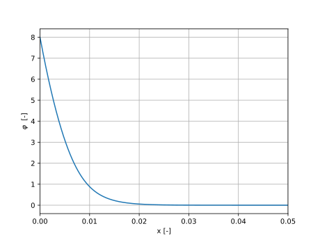
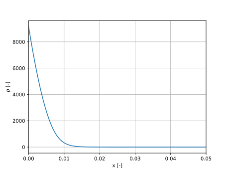
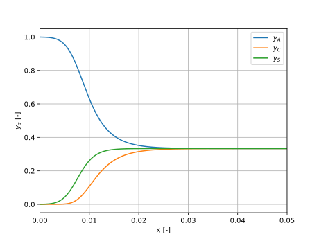

Example
=======

|  In this example, we are going to solve the thermodynamically consistent electrolyte model for a incompressible, ternary electrolyte, as it is done in `https://git.rwth-aachen.de/JanHab/bsc-electrolytemodels/-/blob/main/examples/ReproducableCode/TernaryElectrolyte.py?ref_type=heads <https://git.rwth-aachen.de/JanHab/bsc-electrolytemodels/-/blob/main/examples/ReproducableCode/TernaryElectrolyte.py?ref_type=heads>`_.

Install the package and necessary libraries
-------------------------------------------

.. code-block:: python

    pip install git+https://git.rwth-aachen.de/JanHab/bsc-electrolytemodels
    conda install -c conda-forge fenics-dolfinx=0.8.0 mpich=4.2.1 pyvista=0.43.10 gcc=12.4.0 -y

Import the necessary libraries
-------------------------------------------

.. code-block:: python

    from fxdgm import solve_System_4eq

    import matplotlib.pyplot as plt
    import numpy as np

Define parameters and boundary conditions
-----------------------------------------

.. code-block:: python

    phi_left = 8.0
    phi_right = 0.0
    p_right = 0.0
    y_A_R = 1/3
    y_C_R = 1/3
    z_A = -1.0
    z_C = 1.0
    K = 'incompressible'
    Lambda2 = 8.553e-6
    a2 = 7.5412e-4

Define mesh and solver settings
-------------------------------

.. code-block:: python

    number_cells = 1024
    refinement_style = 'log'
    rtol = 1e-8

Solve the system
----------------

.. code-block:: python

    y_A, y_C, phi, p, x = solve_System_4eq(phi_left, phi_right, p_right, z_A, z_C, y_A_R, y_C_R, K, Lambda2, a2, number_cells, relax_param=0.05, x0=0, x1=1,    refinement_style='hard_log', return_type='Vector', max_iter=1_000, rtol=rtol)

Visualize the results
---------------------

.. code-block:: python

    plt.figure()
    plt.plot(x, phi)
    plt.xlabel('x [-]')
    plt.ylabel('$\\varphi$  [-]')
    plt.xlim(0,0.05)
    plt.grid()
    plt.show()

    plt.figure()
    plt.plot(x, p)
    plt.xlabel('x [-]')
    plt.ylabel('$p$ [-]')
    plt.xlim(0,0.05)
    plt.grid()
    plt.show()

    plt.figure()
    plt.plot(x, y_A, label='$y_A$')
    plt.plot(x, y_C, label='$y_C$')
    plt.plot(x, 1 - y_A - y_C, label='$y_S$')
    plt.xlabel('x [-]')
    plt.ylabel('$y_\\alpha$ [-]')
    plt.xlim(0,0.05)
    plt.grid()
    plt.legend()
    plt.show()

The electric potential
^^^^^^^^^^^^^^^^^^^^^^^

The pressure 
^^^^^^^^^^^^^

The atomic fractions
^^^^^^^^^^^^^^^^^^^^^
